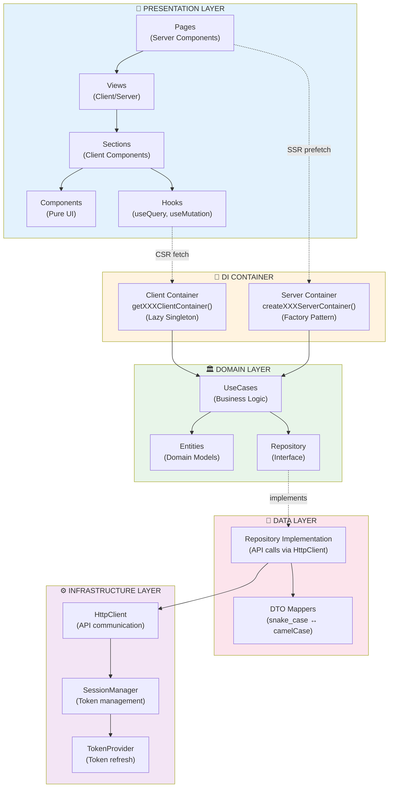
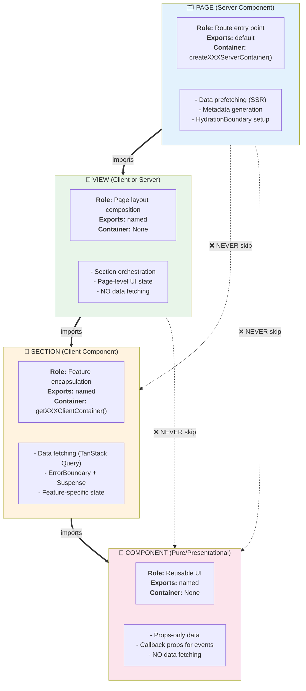
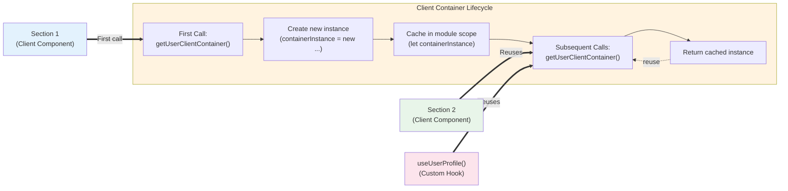
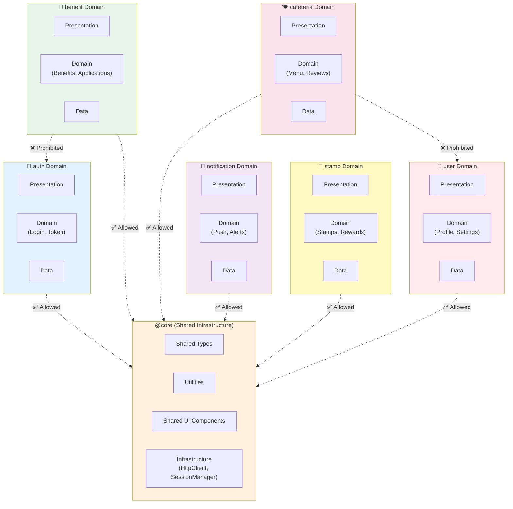
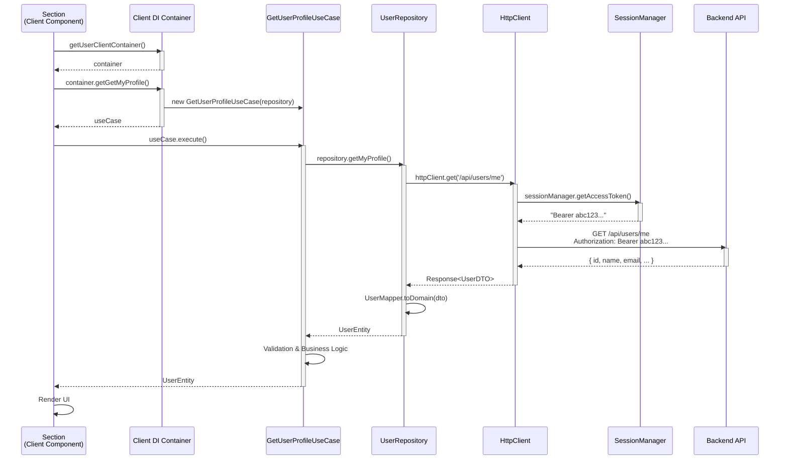
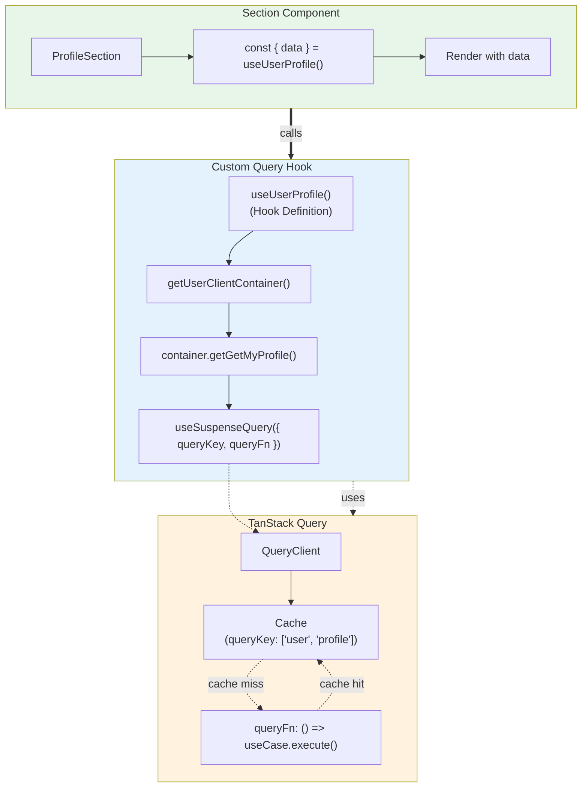
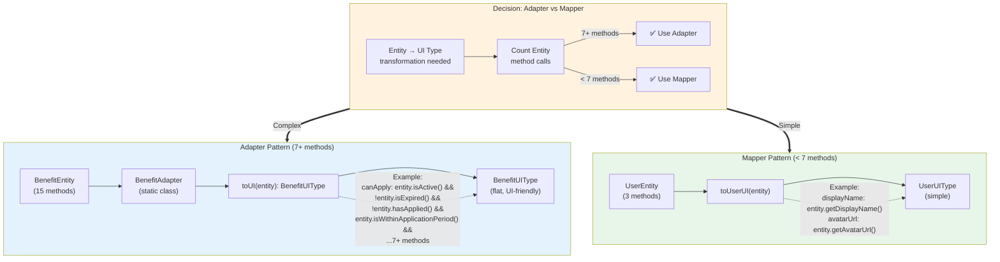

# Architecture Diagrams

> **Purpose**: Visual reference for system architecture using Mermaid diagrams
> **Target Audience**: New developers, visual learners, architecture overview
> **Related Docs**: [core/architecture.md](./core/architecture.md), [frontend/component-hierarchy.md](./frontend/component-hierarchy.md), [ddd/di-server-containers.md](./ddd/di-server-containers.md)

## Table of Contents

1. [Clean Architecture 4 Layers](#1-clean-architecture-4-layers)
2. [Component Hierarchy](#2-component-hierarchy)
3. [Data Flow: SSR → Hydration → CSR](#3-data-flow-ssr--hydration--csr)
4. [DI Container Patterns](#4-di-container-patterns)
5. [Domain Isolation (6 Bounded Contexts)](#5-domain-isolation-6-bounded-contexts)
6. [UseCase → Repository → HttpClient Flow](#6-usecase--repository--httpclient-flow)
7. [Query Hook Pattern](#7-query-hook-pattern)
8. [Adapter Pattern Flow](#8-adapter-pattern-flow)

---

## 1. Clean Architecture 4 Layers

### Overview
Shows the 4-layer Clean Architecture with dependency flow from Presentation → Domain → Data → Infrastructure.



**Key Principles**:
- ✅ Outer layers depend on inner layers (Dependency Inversion)
- ✅ Business logic isolated in Domain layer
- ✅ Infrastructure is a plugin (replaceable)
- ❌ Never skip layers (e.g., Page → Repository)

**Related Documentation**: [core/architecture.md](./core/architecture.md)

---

## 2. Component Hierarchy

### Overview
Shows the 4-tier component hierarchy: Page → View → Section → Component with their responsibilities.



**Import Rules**:
- ✅ Same domain → Relative imports (`../../sections/`)
- ✅ Page → View → Absolute imports (`@/src/domains/auth/...`)
- ✅ Cross-domain → Absolute imports
- ❌ NEVER skip layers (Page → Component)

**Related Documentation**: [frontend/component-hierarchy.md](./frontend/component-hierarchy.md)

---

## 3. Data Flow: SSR → Hydration → CSR

### Overview
Shows complete data flow from Server-Side Rendering (SSR) through hydration to Client-Side Rendering (CSR).

```mermaid
sequenceDiagram
    participant User
    participant Browser
    participant Page as Page<br/>(Server Component)
    participant ServerContainer as Server DI Container
    participant UseCase as GetUserUseCase
    participant View as View<br/>(Client Component)
    participant Section as Section<br/>(Client Component)
    participant ClientContainer as Client DI Container

    Note over User,ClientContainer: 1️⃣ SSR Phase (Server)

    User->>Browser: Navigate to /profile
    Browser->>Page: Request page
    activate Page
    Page->>ServerContainer: createUserServerContainer(sessionManager)
    activate ServerContainer
    ServerContainer-->>Page: container
    deactivate ServerContainer

    Page->>UseCase: container.getGetMyProfile().execute()
    activate UseCase
    UseCase-->>Page: UserEntity
    deactivate UseCase

    Page->>Page: queryClient.prefetchQuery({ queryKey, queryFn })
    Page->>View: Render with HydrationBoundary
    View-->>Browser: HTML + Dehydrated State
    deactivate Page

    Note over Browser,Section: 2️⃣ Hydration Phase (Browser)

    Browser->>Browser: Display HTML immediately
    Browser->>View: Hydrate React components
    activate View
    View->>Section: Mount Section
    deactivate View

    Note over Section,ClientContainer: 3️⃣ CSR Phase (Browser)

    activate Section
    Section->>ClientContainer: getUserClientContainer()
    activate ClientContainer
    ClientContainer-->>Section: container (singleton)
    deactivrate ClientContainer

    Section->>Section: useSuspenseQuery({ queryKey, queryFn })
    Note right of Section: Same queryKey as SSR<br/>→ Cache hit!<br/>No network request

    Section-->>User: Render with cached data
    deactivate Section
```

**Key Insights**:
1. **SSR Phase**: Server prefetches data using Server Container
2. **Hydration**: Browser receives HTML + dehydrated state, displays immediately
3. **CSR Phase**: Client reuses cached data (same queryKey), no duplicate network request
4. **Performance**: User sees content instantly (SSR) + interactive UI (hydration)

**Related Documentation**: [frontend/page-patterns.md](./frontend/page-patterns.md), [frontend/section-patterns.md](./frontend/section-patterns.md)

---

## 4. DI Container Patterns

### Server DI Container (Factory Pattern)

```mermaid
graph LR
    subgraph REQUEST1["Request 1 (User A)"]
        SessionMgr1["SessionManager<br/>(User A token)"]
        ServerContainer1["Server Container<br/>(NEW instance)"]
        UseCase1["GetUserUseCase<br/>(User A data)"]

        SessionMgr1 --> ServerContainer1
        ServerContainer1 --> UseCase1
    end

    subgraph REQUEST2["Request 2 (User B)"]
        SessionMgr2["SessionManager<br/>(User B token)"]
        ServerContainer2["Server Container<br/>(NEW instance)"]
        UseCase2["GetUserUseCase<br/>(User B data)"]

        SessionMgr2 --> ServerContainer2
        ServerContainer2 --> UseCase2
    end

    Page["Page<br/>(Server Component)"] ==>|createUserServerContainer<br/>(sessionMgr1)| REQUEST1
    Page2["Page<br/>(Server Component)"] ==>|createUserServerContainer<br/>(sessionMgr2)| REQUEST2

    style REQUEST1 fill:#e3f2fd
    style REQUEST2 fill:#e8f5e9
    style Page fill:#fff3e0
    style Page2 fill:#fff3e0
```

**Factory Pattern Characteristics**:
- ✅ New instance per request → No state pollution
- ✅ Request-level lifecycle → Automatic cleanup
- ✅ SessionManager parameter → User-specific tokens
- ✅ Thread-safe → No concurrent request issues

### Client DI Container (Lazy Singleton Pattern)



**Lazy Singleton Characteristics**:
- ✅ One instance per app → Consistent cache
- ✅ Lazy initialization → Only created when needed
- ✅ No parameters → Simple API
- ❌ NEVER use in Server Components → State leakage!

**Related Documentation**: [ddd/di-server-containers.md](./ddd/di-server-containers.md), [ddd/di-client-containers.md](./ddd/di-client-containers.md)

---

## 5. Domain Isolation (6 Bounded Contexts)

### Overview
Shows 6 bounded contexts with isolated domain logic, sharing only through `@core`.



**Domain Isolation Rules**:
- ✅ Each domain is self-contained bounded context
- ✅ All domains can depend on `@core`
- ✅ Share types/utilities via `@core/types`, `@core/utils`
- ❌ NEVER import from other domains directly
- ❌ No circular dependencies between domains

**Related Documentation**: [core/architecture.md](./core/architecture.md#6-bounded-contexts)

---

## 6. UseCase → Repository → HttpClient Flow

### Overview
Shows complete flow from UseCase execution through Repository to API call.



**Layer Responsibilities**:
1. **Section**: Orchestrates data fetching via TanStack Query
2. **DI Container**: Provides UseCase with all dependencies
3. **UseCase**: Business logic, validation, orchestration
4. **Repository**: Data access abstraction, DTO → Entity mapping
5. **HttpClient**: HTTP communication, token injection
6. **SessionManager**: Token management, refresh logic

**Related Documentation**: [ddd/usecase-patterns.md](./ddd/usecase-patterns.md), [ddd/repository-patterns.md](./ddd/repository-patterns.md)

---

## 7. Query Hook Pattern

### Overview
Shows how Query Hooks integrate with Client DI Container and TanStack Query.



**Query Hook Pattern**:
1. ✅ Hook encapsulates Container + UseCase logic
2. ✅ Uses `useSuspenseQuery` for automatic suspense
3. ✅ Consistent queryKey for cache management
4. ✅ Centralized error handling via ErrorBoundary
5. ❌ NEVER use deprecated Factory pattern

**Related Documentation**: [patterns/query-hooks.md](./patterns/query-hooks.md)

---

## 8. Adapter Pattern Flow

### Overview
Shows when and how to use Adapter vs Mapper for Entity → UI Type transformation.



**When to Use Each**:

| Pattern | Method Calls | Location | Example |
|---------|-------------|----------|---------|
| **Adapter** | 7+ methods | `presentation/adapters/` | `BenefitAdapter.toUI(entity)` |
| **Mapper** | < 7 methods | `presentation/mappers/` or inline | `toUserUI(entity)` |

**Adapter Benefits**:
- ✅ Type-safe conversion (no unsafe `as`)
- ✅ Centralized complex logic
- ✅ Comprehensive JSDoc documentation
- ✅ Reusable across multiple components
- ✅ Testable in isolation

**Related Documentation**: [patterns/adapter-basics.md](./patterns/adapter-basics.md), [patterns/adapter-implementation.md](./patterns/adapter-implementation.md)

---

## How to Use These Diagrams

### For New Developers:
1. **Start with #1** (Clean Architecture) to understand overall system structure
2. **Read #2** (Component Hierarchy) to learn frontend organization
3. **Study #3** (Data Flow) to understand SSR → CSR process
4. **Review #4** (DI Containers) to grasp dependency injection patterns
5. **Explore #5-8** for specific pattern deep dives

### For Architecture Decisions:
- Use **#1** when explaining layer boundaries
- Use **#2** when discussing component structure
- Use **#4** when debugging Container issues
- Use **#5** when planning domain boundaries
- Use **#8** when deciding Adapter vs Mapper

### For Code Reviews:
- Reference **#2** for component hierarchy violations
- Reference **#4** for wrong Container usage
- Reference **#5** for cross-domain import violations
- Reference **#6** for layer-skipping issues

---

## Related Documentation

- **[core/architecture.md](./core/architecture.md)** — Architecture overview, MUST/NEVER rules
- **[frontend/component-hierarchy.md](./frontend/component-hierarchy.md)** — Component hierarchy details
- **[ddd/di-server-containers.md](./ddd/di-server-containers.md)** — Server Container implementation
- **[ddd/di-client-containers.md](./ddd/di-client-containers.md)** — Client Container implementation
- **[patterns/adapter-basics.md](./patterns/adapter-basics.md)** — Adapter pattern guide
- **[patterns/query-hooks.md](./patterns/query-hooks.md)** — Query Hook pattern

---

**Note**: These Mermaid diagrams complement (not replace) the ASCII diagrams in the original documentation. Both serve different purposes:
- **ASCII diagrams**: Quick reference, works in all text editors
- **Mermaid diagrams**: Visual learning, architecture presentations, onboarding

For best results, use both in combination based on your learning style and context.
